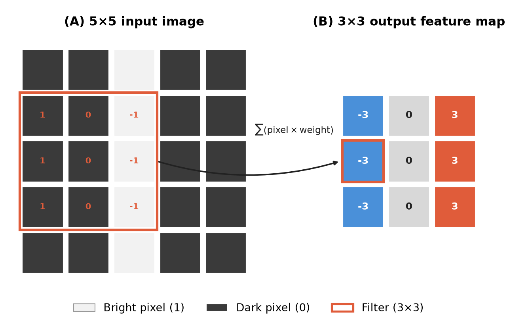
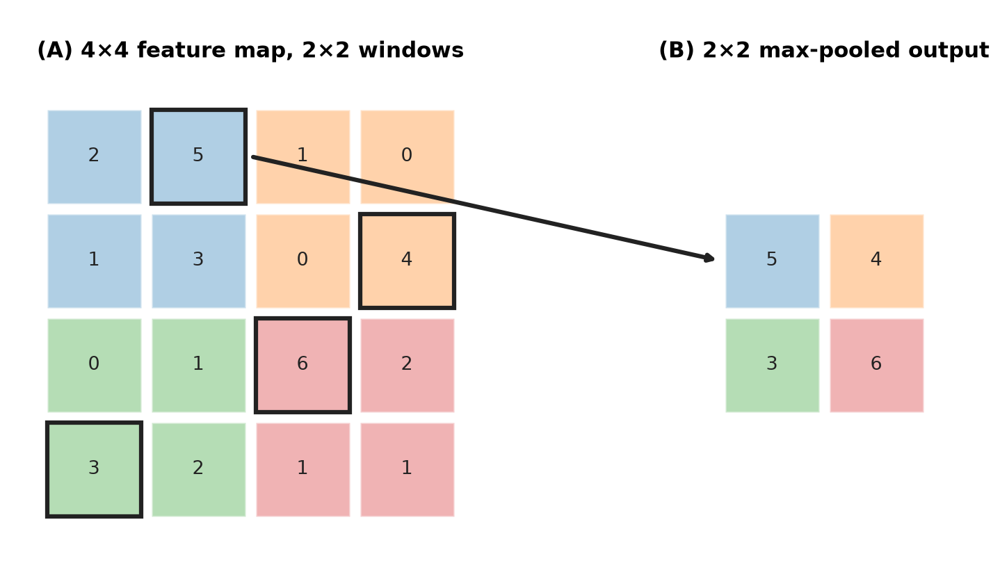
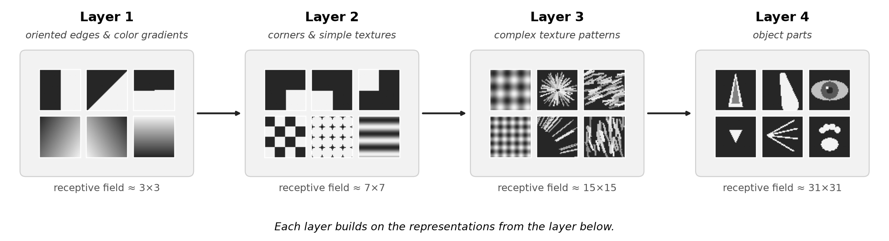
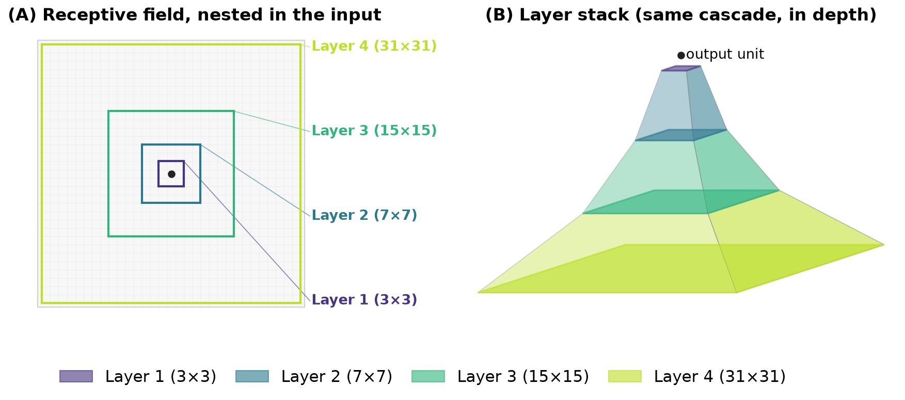
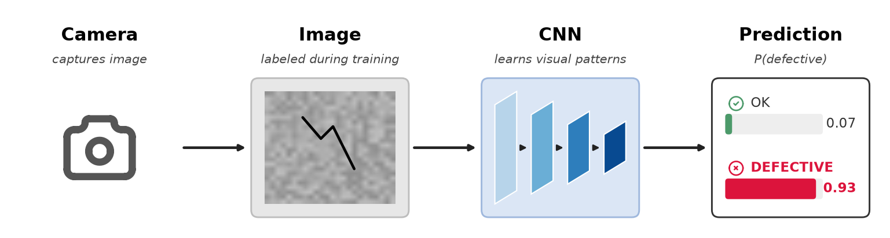
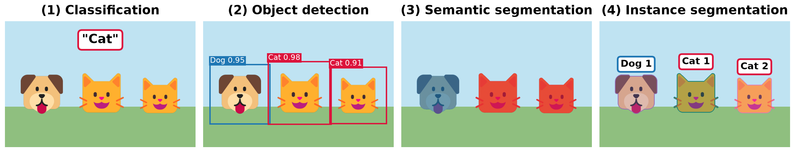

> **Navigation:** [<-- Building Blocks of Deep Networks](02-deep-networks.md) | [Part Index](00-index.md) | [Main Index](../index.md) | [What Deep Networks Learn: Representations -->](04-dl-representations.md)

---

# Convolutional Neural Networks (CNNs)

**Requires**: [Building Blocks of Deep Networks](02-deep-networks.md) · [Classification Tasks](../part-05-supervised-learning/07-classification-tasks.md)

**Motivation**: A fully connected layer treats every pixel as an independent input feature. For a 256×256 image, that is 65,536 inputs: the first hidden layer has thousands of neurons, meaning tens of millions of weights from the first layer alone. More critically, a fully connected layer has no built-in notion that pixel (10,10) and pixel (11,10) are neighbors. Convolutional neural networks solve both problems at once: They drastically reduce the number of parameters and they explicitly exploit the spatial structure of the image.

> In this nugget, you'll see how convolution filters help detecting local patterns by sliding over the image, how stacking convolutional layers builds hierarchical image representations, and how CNNs are the starting point for a family of specialized vision tasks far beyond basic classification.

## Table of Contents

- [Convolution as Local Pattern Detection](#convolution-as-local-pattern-detection)
- [Image Classification and Softmax-Function](#image-classification-and-softmax-function)
- [CNN-Based Image Tasks](#cnn-based-image-tasks)
- [Summary](#summary)

## Convolution as Local Pattern Detection

A **convolutional layer** applies a small filter (also called a **kernel**) to a local region of the input image, slides it across the entire image, and produces a **feature map**. The filter is a small grid of weights that is learned during training, for example a $3 \times 3$ matrix, show by the orange box in the figure. This architecture traces back to the neocognitron [(Fukushima, 1980)](../references.md#fukushima1980), which introduced convolution and downsampling layers for shift-invariant pattern recognition; LeCun et al. later combined this architecture with backpropagation training for handwritten digit recognition [(LeCun et al., 1998)](../references.md#lecun1998).

The filter slides across the image in steps (**strides**). At each position, it computes a weighted sum of the pixel values it currently covers. The result at each position is one value in the output feature map. Each filter learns to detect one type of local pattern.

> **Background (filters in classical image processing):** Classical image processing also uses the filter idea with hand-crafted weights instead of learned ones. Take the filter shown above: its column values from left to right are +1, 0, -1. At a vertical edge, where brightness changes sharply, the difference is large, so the filter "fires": it **picks out edges running vertically**. In contrast, in flat region, where neighboring pixels have similar brightness, the pixel differences are close to zero: The filter outputs roughly zero.
> This classic hand-designed filter is called the [🔗 Prewitt operator](https://en.wikipedia.org/wiki/Prewitt_operator). The related [🔗 Sobel operator](https://en.wikipedia.org/wiki/Sobel_operator) extends it by weighting the center row more heavily to also suppress noise.

A CNN learns filters that play the same role as in classic image processing, but the specific patterns are not designed by hand: They are learned from data.

### What makes CNNs parameter-efficient

CNNs embody two design choices that keep the parameter count manageable:

- **Weight sharing**: the same filter weights are applied at every spatial position. A filter that detects a vertical edge detects it wherever it appears in the image, without separate weights per location.
- **Pooling**: after convolution, a **max pooling** operation downsamples the feature map by taking the maximum value in each local region. This reduces spatial resolution, retains the strongest activations, and gives the network some invariance to small translations.

> **Analogy:** Think of a filter as a stamp. You press the same stamp at every location on the image. Where the stamp matches the underlying pattern, the output is high; where it does not match, the output is low. The network learns what shape the stamp should be.

Stacking convolutional layers builds hierarchical representations. Early layers detect simple local patterns (edges, textures). Later layers combine those patterns into more complex structures (shapes, parts, objects). The idea is that the "receptive field" of a filter increases the deeper the layer. We'll discuss this further in the next nugget [🖝 What Deep Networks Learn: Representations](../part-08-deep-learning/04-dl-representations.md), here

This feature hierarchy is the computational realization of the feature learning you saw in [🖝 When Shallow Models Fail](../part-08-deep-learning/01-when-shallow-fails.md).
Here's another visualization of how the receptive field increases:

---

## Image Classification and Softmax-Function

Image classification assigns a single label to an entire image, just like for all [🖝 Classification Tasks](../part-05-supervised-learning/07-classification-tasks.md). Only that here the input is a pixel grid, and the output is a class or a probability distribution over a fixed set of classes.

A standard classification CNN ends with one or more fully connected layers after the convolutional blocks. The final layer has one output neuron per class, with a **softmax** activation that normalizes the outputs into a valid probability distribution:

$$a_k = \frac{e^{z_k}}{\sum_{j=1}^{K} e^{z_j}} \quad \text{for } k = 1, \ldots, K.$$

Here, for $K$ classes, the output neurons compute weighted sums $z_1, \ldots, z_K$ as usual, and softmax turns them into probabilities: $a_k$ is the predicted probability of class $k$, and all outputs sum to 1, that is, $\sum_k a_k = 1$.

Below is a practical example: defect detection on a production line. A suitable camera system captures images of manufactured parts. For the training, each image is labeled "OK" or "defective". A CNN trains on labeled examples and learns to recognize the visual patterns that indicate a defect: This could be a scratch, a crack, or particles. At inference time, the trained model processes each new image and produces a probability of being defective as output.

The same architecture can handle multi-class problems (using the softmax function above). For example, a dataset with ten different defect types becomes a 10-class classification problem. The CNN structure remains the same, only the size of the output layer changes. Evaluation then uses multi-class metrics, as discussed in [🖝 Decision Trees](../part-05-supervised-learning/09-decision-trees.md).

---

## CNN-Based Image Tasks

Classification is the simplest vision task. Once a CNN has learned to represent visual structure, those learned features can be adapted to a range of more demanding tasks. All of these extensions *can* build on the same convolutional backbone, which functionally serves as the **feature extractor**.
The different task families just add different output heads for their specific prediction targets.

The main task families:

- **Classification** as above - simply output a label or distribution per input image.

- **Object detection** locates and classifies multiple objects within the same image. The output is a set of bounding boxes with class labels and confidence scores. Popular architectures: YOLO, SSD, Faster R-CNN. The key difference from classification: the model must predict *where* objects are, not just *what* is in the image.

- **Semantic segmentation** assigns a class label to every pixel. The output is a full image mask, where each pixel is colored according to its class (road, building, sky). Architectures like FCN and U-Net use an encoder-decoder structure: the encoder extracts features at decreasing resolution; the decoder reconstructs full-resolution predictions.

- **Instance segmentation** extends semantic segmentation by distinguishing individual object instances. Two adjacent objects of the same class get different instance masks. Mask R-CNN is the standard architecture.

Beyond the four families mentioned above:

- **Keypoint and pose estimation** detects specific landmark points on objects, for example, joint positions on a human body or corners of a document. The model predicts a spatial location ($x$, $y$ coordinates) for each keypoint rather than a class label.

- **Super-resolution** reconstructs a high-resolution image from a low-resolution input. The model learns to recover plausible detail that the low-resolution input cannot contain.

> **Note:** You do not need to master any of these architectures to apply them. Pretrained models for most of these tasks are available off the shelf. The conceptual map above tells you *which task type to reach for* when you face a specific vision problem.

---

## Summary

- A convolutional layer applies a small learned filter across an image, detecting local patterns at every spatial position. Weight sharing and pooling keep the parameter count manageable and give the network spatial invariance.
- Stacking convolutional layers builds a feature hierarchy: edges in early layers, shapes and parts in later layers.
- Image classification maps a whole image to a label. The same CNN backbone extends to harder tasks: object detection (where + what), semantic segmentation (per-pixel class), instance segmentation (per-object mask), keypoint estimation, and super-resolution.
- These task families all reuse the same convolutional backbone. Understanding the task family helps you choose the right architecture and the right pretrained starting point.

As always: Happy learning, happy life! 🫶

---

> **Navigation:** [<-- Building Blocks of Deep Networks](02-deep-networks.md) | [Part Index](00-index.md) | [Main Index](../index.md) | [What Deep Networks Learn: Representations -->](04-dl-representations.md)

Script v1.8 (2026-08-19) · FGN
