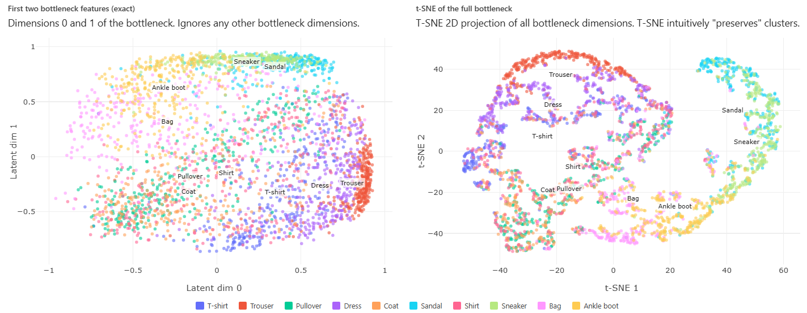

> **Navigation:** [<-- Convolutional Neural Networks (CNNs)](03-cnns.md) | [Part Index](00-index.md) | [Main Index](../index.md) | [Transfer Learning -->](05-transfer-learning.md)

---

# What Deep Networks Learn: Representations

**Requires**: [Building Blocks of Deep Networks](02-deep-networks.md) · [Convolutional Neural Networks (CNNs)](03-cnns.md)

**Motivation**: So far you have seen *how* a deep network computes predictions: filters, layers, backpropagation. But a deeper question is what the network actually *learns* when it trains. There are "mechanics" like weights and gradients. But what are the "concepts" inside? This nugget answers that question by looking at what deep networks represent internally — and why those representations are one of the most powerful things the framework produces.

> You'll see how stacked layers build progressively abstract features, what an embedding is and why learned geometry in high-dimensional space is a useful idea, and how t-SNE lets you look inside a trained model to check whether its representations make sense.

## Table of Contents

- [What Depth Buys: Hierarchical Feature Learning](#what-depth-buys-hierarchical-feature-learning)
- [Embeddings: Learned Features as Geometry](#embeddings-learned-features-as-geometry)
- [t-SNE: Seeing the Latent Space](#t-sne-seeing-the-latent-space)
- [Summary](#summary)

## What Depth Buys: Hierarchical Feature Learning

As we saw in [🖝 Convolutional Neural Networks (CNNs)](../part-08-deep-learning/03-cnns.md), a single convolutional layer detects local patterns w.r.t. its input. Due to this locality, a single convolutional layer cannot "know" about objects. Instead, the real power comes from stacking layers. Later layers do not see raw pixels: they outputs from previous layers - be it corners, edge or texture maps, shapes, parts, objects: whatever abstraction is already present in the input layer.
The following graphic illustrates thir hierarchical feature extraction:

In real applications there'll usuall be more layers than just the four used here for illustration.
What matters for practice is that depth enables composition: complex concepts are built out of simpler ones, and the building is supposed to happen automatically during training.

<!-- The feature hierarchy mirrors how visual information is organized in biological vision systems: The visual cortex responds to oriented edges, later areas respond to faces and objects - though the analogy should not be taken too literally. -->

> **Note (limits of the intuition):** The hierarchy is learned, not designed. You do not specify that layer 3 should detect curves. It is completely up to the training process to discover whether and where "curves" might be detected or represented inside a network.

<!-- JODO: representation theorem - shallow models could in principle learn everything too... -->

The same principle (hierarchical feature extraction) applies to non-image data modalities as well, for example:

- In speech processing (audio data), early layers may detect phoneme-level acoustic features; later layers detect words and phrases.
- In text, early layers may detect character-level patterns, later layers typically encode meaning.

---

## Embeddings: Learned Features as Geometry

An **embedding** is the representation produced by an intermediate layer, typically the last one before the output. An embedding is simply a high-dimensional vector that is obtained by concatenating the output values of the neurons of the intermediate layer. We call the space in which these embedding vectors live the **embedding space**. For example, a layer with 512 neurons maps each input to a point in a 512-dimensional embedding space.

Intuitively, an embedding is a learned summary of the input: A good embedding captures semantically meaningful information while abstracting from the "noise" in the input data. So the following two properties should hold:

1. Two inputs that activate similar neurons in the embedding layer  will produce embeddings that are close together in the embedding space (for example, two images that look structurally similar to the network).
2. Two inputs that activate different neurons will have embeddings that are far apart.

If these geometric properties hold, then the embeddings are useful beyond the original task of the network:

- **Similarity search**: finding images or documents that are "close" to a reference image/document in embedding space.
- **Transfer learning**: using the embedding from a model trained on one dataset as input features for a new task on a different dataset. We'll discuss this more in [🖝 Transfer Learning](../part-08-deep-learning/05-transfer-learning.md).
- **Clustering**: apply [🖝 k-Means Clustering](../part-07-unsupervised-learning/02-k-means-clustering.md) or other clustering methods in embedding space rather than raw input space.

The shift from manual feature engineering to learned embeddings is fundamental. In [🖝 Feature Engineering](../part-04-data-preparation/01-feature-engineering.md), you designed features by hand by combining and transforming features. When hand-crafting features becomes infeasible, training a deep network can automate the process: embeddings are the learned features. However, this comes with a cost: While manually engineered feature are well interpretable, embedding dimensions do usually not have an intrinsic human-readable interpretation.

> **Discussion:** Embeddings from a model trained for image classification often cluster objects of the same category together in embedding space, even for categories the original model was not explicitly trained on. What property of the training objective makes this generalization possible, and what does it tell you about the nature of the features the network has learned?

---

## t-SNE: Seeing the Latent Space

Embeddings are useful but generally invisible as intermediate computations. This is why we often also hear the term **latent** space: latent means something is present, but hidden.
As we saw in the previous section, understanding the structure of the latent embedding space is an interesting goal in itself.
Unfortunately, a high-dimensional space cannot be plotted directly. So we need dimension reduction techniques first.

**t-SNE** (t-distributed Stochastic Neighbor Embedding) [(Van der Maaten & Hinton, 2008)](../references.md#vandermaaten2008) is one such dimension reduction technique that projects high-dimensional embeddings into 2D while trying to preserve neighborhood relationships: points that are close in embedding space should remain close in the 2D projection.

The procedure is:

1. Take a trained model and extract embeddings for all examples in a dataset.
2. Run t-SNE on those embeddings to produce 2D coordinates.
3. Plot the points, colored by label.

Here's are two example visualizations of an embedding space from a trained [🖝 Autoencoders](../part-08-deep-learning/06-autoencoder.md) for the Fashion MNIST dataset.

The plot reveals how the network "sees" the data.
The left side simply visualizes the first two embedding dimensions, whereas the right side shows a t-SNE projection.
If same-class images cluster together, the model has learned features that genuinely discriminate between classes. If clusters from different classes overlap, the model's representations may be  ambiguous in that region.

This kind of reasoning is why T-SNE is also an **explainability** tool. If you want to know why the model misclassified a particular example, it may be helpful to find it on the t-SNE plot: it is likely near the boundary between two clusters, or isolated from its own class. It tells you something about what the input looks like to the model: not in pixel terms, but in representational terms.

<!-- TODO: stochastic nature -->

> **Note:** t-SNE is not unique to deep learning. It can be applied to any set of high-dimensional vectors. But embeddings from deep networks are its most common use in practice, because they are high-dimensional and meaningful in ways that reward inspection.

---

## Summary

- Deep networks learn hierarchical representations: early layers detect simple local patterns. later layers compose them into increasingly abstract concepts.
- An embedding is the vector produced by an intermediate layer of the network. Similar inputs have embeddings that are geometrically close. Embeddings generalize beyond the original task and are the basis for similarity search, clustering, and transfer learning.
- t-SNE projects high-dimensional embeddings into 2D for inspection. Clusters in the plot indicate that the model has learned representations that separate meaningful groups.
- Reading a t-SNE plot is an explainability practice: It illustrates  what structure the model has found in the data, and where its representations break down.

As always: Happy learning, happy life! 🫶

---

> **Navigation:** [<-- Convolutional Neural Networks (CNNs)](03-cnns.md) | [Part Index](00-index.md) | [Main Index](../index.md) | [Transfer Learning -->](05-transfer-learning.md)

Script v1.8 (2026-08-19) · FGN
