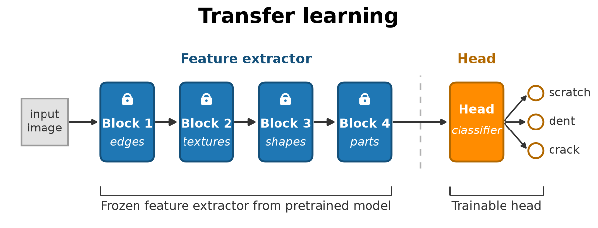

> **Navigation:** [<-- What Deep Networks Learn: Representations](04-dl-representations.md) | [Part Index](00-index.md) | [Main Index](../index.md) | [Autoencoders -->](06-autoencoder.md)

---

# Transfer Learning

**Requires**: [What Deep Networks Learn: Representations](04-dl-representations.md) · [Convolutional Neural Networks (CNNs)](03-cnns.md)

**Motivation**: Training [🖝 Convolutional Neural Networks (CNNs)](../part-08-deep-learning/03-cnns.md) from scratch on a large benchmark datasets is expensive when first done. Few engineering teams can afford that. But in many applications, you don't have to. The representations a network learns on one large dataset often generalize to entirely different tasks. A model trained to classify cats, dogs, vehicles, and so on has learned to extract features like edges, textures, shapes. These are often useful for classifying cracks in concrete or defects in printed circuit boards, too. This is **transfer learning**, and it dramatically lowers the barrier to applying deep learning in practice.

> In this nugget, you'll see how to use pretrained models on new tasks, learn how to choose between feature extraction and fine-tuning, and get an overview of three major frameworks in the deep learning ecosystem.

## Table of Contents

- [The Pretrained Model Idea](#the-pretrained-model-idea)
- [Fine-Tuning vs. Feature Extraction](#fine-tuning-vs-feature-extraction)
- [The DL Ecosystem: PyTorch, Keras, Hugging Face](#the-dl-ecosystem-pytorch-keras-hugging-face)
- [Summary](#summary)

## The Pretrained Model Idea

When a deep network trains on a large dataset, it learns a general-purpose feature hierarchy. For images, this means edge detectors, texture patterns, shape components. These are representations that describe visual structure at multiple levels of abstraction, as you saw in [🖝 What Deep Networks Learn: Representations](../part-08-deep-learning/04-dl-representations.md). These representations must not belong to the specific classes the model was trained on.

This is why it becomes interesting to use a **pretrained model**, that is, a network that has already been trained on a large dataset. You can take this model (specifically, its weights) and adapt it to your task by replacing or retraining the final output layer. This reuses the feature extractor from the pre-trained model:

In the head, you might adjust to your new task: For example, you might only want to classify three types of surface defects instead of the 1000 ImageNet categories that the pretrained model was trained to classify.
Indeed, **ImageNet** [(Deng et al., 2009)](../references.md#deng2009) (a dataset of 1.2 million images across 1,000 classes) is a canonical source for pretrained models: Models like ResNet, EfficientNet, and VGG were trained on ImageNet and are freely available.

The same principle applies to all data modalities: train once on a massive dataset, then adapt to a specific domain. The adaptation cost is far lower than training from scratch.

- For text, pretrained models were trained on billions of documents from the web. BERT, GPT, and their successors learned rich representations of language meaning from this data.

<!-- TODO: source or links -->

> **Analogy:** Think of a pretrained model as an experienced technician who has worked in many factories. She/he has seen many defect types and learned what subtle visual signals to look for. When faced with a new situation in a new facility, experienced workers do not start from scratch, but instead apply their general experience and only need to learn the specifics of the new setting.

---

## Fine-Tuning vs. Feature Extraction

There are two main strategies for adapting a pretrained model to a new task [(Yosinski et al., 2014)](../references.md#yosinski2014).

- **Feature extraction**: freeze all layers of the pretrained model except the output layer. The frozen layers produce embeddings of your new input images. You train only the new output layer on your task-specific labeled data. The pretrained feature extractor is used as-is.
- **Fine-tuning**: unfreeze some or all pretrained layers and continue training on your new dataset with a _small_ learning rate. This allows the pretrained weights to adjust to the specific characteristics of your new domain, while retaining most of what was learned on the original dataset.

The choice depends on the size of your (labeled) dataset:

| Dataset size | Similarity to pretrained domain | Recommended strategy |
|---|---|---|
| Small (< few thousand) | High | Feature extraction |
| Small | Low | Feature extraction + fine-tune last few layers |
| Large | Any | Fine-tune the full network |

When labeled data is scarce, fine-tuning the entire network on a small dataset risks overfitting: The network has more parameters than your data can constrain. In this case, using fixed pretrained layers and only training the small new head is usually better.

As a concrete example, object detection models like [🔗 YOLO](https://docs.ultralytics.com/) are built on a pretrained CNN **backbone** (a standard classification network with the last layer removed). The backbone extracts visual features and only the detection head is added and trained for the specific detection task.

---

## The DL Ecosystem: PyTorch, Keras, Hugging Face

The practical landscape for deep learning work is vast. Here's just a quick overview of a few tools and libraries for orientation.

**PyTorch** (Meta AI) is a widely-used framework for deep learning research and production. It defines the network architecture explicitly as Python code, making it flexible and debuggable. Many new architectures are published with PyTorch implementations. If you plan to build custom models, train on your own data pipeline, or work close to the research frontier, PyTorch is often a good choice.

**TensorFlow (including Keras)**: Especially Keras is a high-level API designed for quick prototyping. It abstracts away the details of the training loop, making it faster to build and iterate on standard architectures. The tradeoff is less control over the training process. Good for getting a working model quickly when the task is standard.

**Hugging Face** is a model hub and library focused on pretrained models, especially for text and multimodal tasks. It hosts thousands of pretrained models ready for download and fine-tuning, along with the `transformers` library for working with them. For transfer learning, Hugging Face is the starting point for the vast majority of practitioners.

What you'll need and choose will largely depend on the application and which resources are availaible in which eco-system.

---

## Summary

- Pretrained models transfer knowledge across tasks. A model trained on a large dataset has learned general-purpose representations that generalize to new domains.
- Feature extraction freezes pretrained layers and trains only the output head. Fine-tuning continues training the pretrained layers on the new dataset. Dataset size and domain similarity determine which strategy is better.
- Major ecosystem tools: PyTorch for flexible custom work, Keras for rapid prototyping, Hugging Face for accessing pretrained models.
- Transfer learning is often the practical default for deep learning on limited labeled data.

As always: Happy learning, happy life! 🫶

---

> **Navigation:** [<-- What Deep Networks Learn: Representations](04-dl-representations.md) | [Part Index](00-index.md) | [Main Index](../index.md) | [Autoencoders -->](06-autoencoder.md)

Script v1.8 (2026-08-19) · FGN
