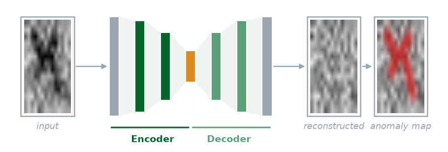

> **Navigation:** [<-- Transfer Learning](05-transfer-learning.md) | [Part Index](00-index.md) | [Main Index](../index.md) | [Transformers -->](07-transformers.md)

---

# Autoencoders

**Requires**: [What Deep Networks Learn: Representations](04-dl-representations.md) · [Anomaly Detection](../part-07-unsupervised-learning/03-anomaly-detection.md)

**Motivation**: In [🖝 Anomaly Detection](../part-07-unsupervised-learning/03-anomaly-detection.md) and [🖝 Isolation Forests](../part-07-unsupervised-learning/04-isolation-forests.md), you built anomaly detectors using statistical thresholds and tree-based isolation. These methods are mostly viable on tabular data with just a few features. However, if the input data is high-dimensional, like spectrums or large images, then neither "classical" method scales well. In those cases, autoencoders can bring the representational power of deep learning to anomaly detection.

> In this nugget, you'll see how a network can be trained to reconstruct its own inputs, how to read high reconstruction error as anomaly signals, how the encoder-decoder architecture connects to the representation concepts from the previous nuggets. You'll generally see when autoencoders are the right tool compared to simpler baselines.

> **Interactive demo note:** You can interactively explore everything from this nugget in the **Autoencoder** demo from my [✪ interactive data-science demos](https://github.com/fgnussbaum/ds-ml-interactive-demos) repository.

## Table of Contents

- [Reconstruction Error as an Anomaly Signal](#reconstruction-error-as-an-anomaly-signal)
- [Connection to Deep Learning](#connection-to-deep-learning)
- [When to Consider Autoencoders](#when-to-consider-autoencoders)
- [Summary](#summary)

## Reconstruction Error as an Anomaly Signal

An **autoencoder** [(Hinton & Salakhutdinov, 2006)](../references.md#hinton2006) is a neural network trained to reproduce its own input. The network takes an input $\mathbf{x}$, maps it to a compressed intermediate representation (the "latent" bottleneck), and then tries to reconstruct $\hat{\mathbf{x}}$ from that representation. The loss function is the **reconstruction error**, which measures the discrepancy between $\mathbf{x}$ and $\hat{\mathbf{x}}$. A typical choice sums the squared deviations:

$$\mathcal{L} = \frac{1}{n} \sum_{i=1}^{n} \|\mathbf{x}_i - \hat{\mathbf{x}}_i\|^2.$$

The idea for autoencoders is that they should learn to compress and reconstruct the patterns typical of normal inputs.

> When used for anomaly detection, autoencoders are trained on **normal data only**.

During inference (after training), a well-trained autoencoder then behaves as follows:

- For normal inputs, the autoencoder produces small reconstruction errors - because the data is similar to what the autoencoder has seen during training.
- For anomalous inputs (that look different from anything in the training set), the autoencoder cannot reconstruct them well, producing a high reconstruction error.

This is the anomaly signal: typical/normal inputs produce low reconstruction error; anomalous inputs produce high reconstruction error.

Like [🖝 Isolation Forests](../part-07-unsupervised-learning/04-isolation-forests.md) or other anomaly detection methods, the approach requires no anomaly labels. You only need a collection of normal examples, which is usually available: a machine running correctly, a product without defects, a system in steady state. This is a big advantage!

> **Note:** To flag anomalies, some kind of threshold is needed to separate "high" from "low" reconstruction error. This threshold is a hyperparameter. You set it based on the distribution of reconstruction errors on a held-out normal set, just as you would set a z-score threshold in [🖝 Anomaly Detection](../part-07-unsupervised-learning/03-anomaly-detection.md). The threshold controls the tradeoff between precision (not raising too many false alamars) and recall (not missing real anomalies).

---

## Connection to Deep Learning

An autoencoder consists of two subnetworks:

- The **encoder** maps the input to a low-dimensional representation: $\mathbf{z} = \text{Encoder}(\mathbf{x})$
- The **decoder** maps the representation back to the input space: $\hat{\mathbf{x}} = \text{Decoder}(\mathbf{z})$

The bottleneck ist the low-dimensional layer $\mathbf{z}$ between encoder and decoder. This is exactly the **embedding** from [🖝 What Deep Networks Learn: Representations](../part-08-deep-learning/04-dl-representations.md): Here, it is chosen relatively low-dimensional on purpose. It has no capacity to model noise from the input. Generally, the encoder is learning a compressed representation of the input.

- For normal inputs, this representation captures the structure efficiently (though it may cut away "high-frequency features" like sharp edges).
- For anomalous inputs, the bottleneck discards the unusual details, and reconstruction fails.

The encoder is also a feature extractor. The bottleneck $\mathbf{z}$ tends to capture the most structure-relevant information in the input. Since it contains semantic information, the bottleneck can therefore be used for clustering, visualization (e.g., via t-SNE), or as input to a downstream classifier if some labels later become available. This dual use, anomaly detection and representation learning, makes autoencoders a flexible building block.

---

## When to Consider Autoencoders

Nevertheless, an autoencoder is not always the right tool. Simpler methods should come first. The principle from [🖝 Baselines and the Good-Enough Bar](../part-06-reflection/03-baselines.md) applies here exactly as elsewhere: start with z-score thresholds from [🖝 Anomaly Detection](../part-07-unsupervised-learning/03-anomaly-detection.md), then try [🖝 Isolation Forests](../part-07-unsupervised-learning/04-isolation-forests.md), unless the data domain prohibits it outright due to high-dimensionality.

Here's an overview of conditions that favor autoencoders:

- **High-dimensional input**: images, spectra, waveforms with hundreds/thousands of channels.
- **Enough normal training data**: Autoencoders need enough examples of normal behavior to learn a good reconstruction model. A few dozen examples are usually not enough, while a few hundred to a few thousand can provide a more robust training ground.
- **Compute budget allows it**: an autoencoder is more expensive to train and serve than a the "classical" methods (such as thresholds or isolation forests). For real-time embedded systems, this cost may be prohibitive.

> **Discussion (mini "case study"):** An autoencoder trained on spectroscopy data from a chemical process flags a sample as anomalous (high reconstruction error). A domain expert inspects the sample and says it looks normal to them. Is this more likely to be a true false positive, a threshold calibration issue, or a sign that the autoencoder learned spurious patterns in the training data? How would you investigate each of these possibilities?

---

## Summary

- Autoencoders are trained to reconstruct inputs. Trained on normal data only, it reconstructs normal inputs well and anomalous inputs poorly. High reconstruction error is the anomaly signal.
- The encoder-decoder structure produces a bottleneck embedding, connecting autoencoders directly to the representation learning concepts (previous nugget).
- Autoencoders are the right tool when inputs are high-dimensional (images, spectra), enough normal data is available for training, and simpler baselines are insufficient.

As always: Happy learning, happy life! 🫶

---

> **Navigation:** [<-- Transfer Learning](05-transfer-learning.md) | [Part Index](00-index.md) | [Main Index](../index.md) | [Transformers -->](07-transformers.md)

Script v1.7 (2026-07-28) · FGN
