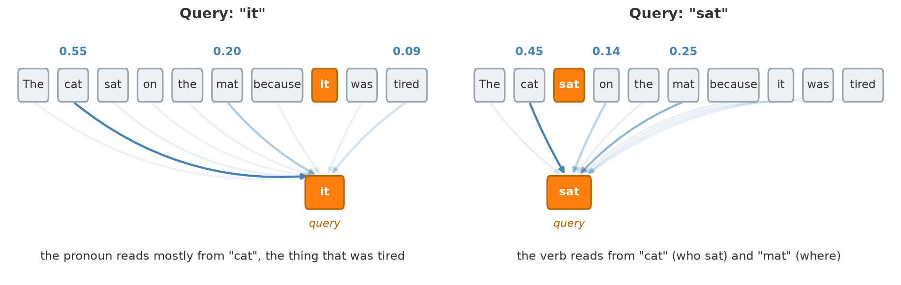
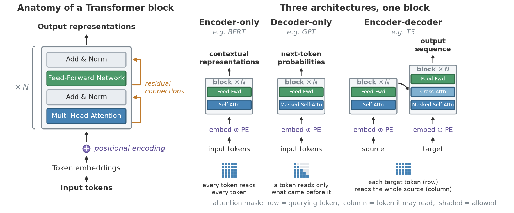

> **Navigation:** [<-- Autoencoders](06-autoencoder.md) | [Part Index](00-index.md) | [Main Index](../index.md) | [Deep Learning in Practice: Choosing and Applying -->](08-dl-in-practice.md)

---

# Transformers

**Requires**: [Building Blocks of Deep Networks](02-deep-networks.md) · [Convolutional Neural Networks (CNNs)](03-cnns.md)

**Motivation**: [🖝 Convolutional Neural Networks (CNNs)](../part-08-deep-learning/03-cnns.md) scan the input with local filters, for example a $3 \times 3$ window for images, a short time window for signals. For many tasks this locality is exactly right. For language, it is a fundamental limitation. The meaning of a pronoun depends on its antecedent several sentences back. The translation of a word depends on the entire sentence context. The transformer architecture was designed to break the locality constraint, allowing every part of the input to directly relate to every other part. It is now the foundation of nearly every large language model in use.

> Here, you'll see why position matters in sequences, how the attention mechanism lets any token draw on any other, what the transformer architecture looks like at a high level, and how BERT, GPT, and foundation models emerge from scaling this architecture.

## Table of Contents

- [The Sequence Problem: Why Position Matters](#the-sequence-problem-why-position-matters)
- [Attention: Relating Any Token to Any Other](#attention-relating-any-token-to-any-other)
- [The Transformer Architecture](#the-transformer-architecture)
- [From BERT to GPT to Foundation Models](#from-bert-to-gpt-to-foundation-models)
- [Bonus: Scaled Dot-Product Attention in Full](#bonus-scaled-dot-product-attention-in-full)
- [Summary](#summary)

## The Sequence Problem: Why Position Matters

A sentence is not a bag of words. "The dog bit the man" and "The man bit the dog" contain the same words but have opposite meanings. Position carries information, and any model that ignores position loses it.

- [🖝 Convolutional Neural Networks (CNNs)](../part-08-deep-learning/03-cnns.md) for sequential word data handle position by using small one-dimensional sliding windows. A convolution with window size $k$ makes each output depend on $k$ consecutive inputs. For a short phrase or a local signal pattern, this is efficient and effective. But with fixed window size it is hard to capture a dependency between token 1 and token 40. To cover the full sequence, many convolutional layers would need to be stacked, and each layer only extends the receptive field by $k$ steps.

- **Recurrent neural networks (RNNs)** process sequences step by step, maintaining a hidden state that summarizes the history up to the current token. This handles long-range dependencies in principle, but in practice the hidden state becomes a bottleneck: information from early tokens gets diluted as the sequence grows. Training long sequences with RNNs is also slow because steps must be computed sequentially, so you cannot parallelize over the time axis.

Transformers solve both problems: they process all positions in parallel (no sequential bottleneck) and allow any position to directly attend to any other position (no fixed window). The price is memory: attention computes a score for every pair of positions, which scales quadratically with sequence length.

---

## Attention: Relating Any Token to Any Other

The core of a transformer is the **attention mechanism** [(Vaswani et al., 2017)](../references.md#vaswani2017). For a sequence of tokens (words, subwords, or other units), attention lets each token "look at" every other token and decide how much weight to give each one when building its own representation.

Each token's embedding is mapped by **learned** matrices. Specifically, each token has one parameter vector for each of the following three roles:

- a **query** (what this token is looking for),
- a **key** (what this token offers to others), and
- a **value** (the content it passes on).

For the token at position $i$, attention compares its query against the key of every token $j$. This produces similarity scores, which softmax turns into weights that sum to one:

$$w_{ij} = \operatorname{softmax}_j\left(\frac{q_i \cdot k_j}{\sqrt{d_k}}\right)$$

For intuition on these weights, see the illustration of them as arrows in the figure below. The weights $w_{ij}$ form a probability distribution over all positions, not a hard pick of any particular token. Note that in the formula:

- $q_i \cdot k_j$ is the raw similarity between token $i$'s query $q_i$ and token $j$'s key $k_j$,
- $d_k$ is the dimension of the key vectors.

Next, the new representation for token $i$ is calculated as a weighted average of the token-specific value vectors $v_j$:

$$z_i = \sum_j w_{ij}\, v_j.$$

So the representation gets contributions from other tokens proportionally to the attention computed to those tokens.

Also observe that nothing in the two formula refers to distance in the sequence, so any token is equally reachable (e.g., token 1 and 40 are exactly as reachable as immediate neighbors).

The figure shows the same sentence twice, changing only which token is the query. Relevance is not a fixed property of the sentence, it is computed per query token: the pronoun "it" draws mostly on "cat", while the verb "sat" draws on its subject "cat" and its location "mat". Which tokens end up connected is learned during training, it is not hardwired.

In practice, multiple attention heads are used: **multi-head attention**. One of its major advantages is that it can run several attention operations in parallel, each with its own learned query, key, and value matrices. The outputs are concatenated and projected back to the model's internal dimension. Multiple heads let the model attend to different types of relationship within the same layer (for example: syntactic relationships like subject-verb agreement, coreference like pronouns and their antecedents, or positional proximity).

> **Analogy:** Match the attention mechanism presented here to how you read text: To understand the meaning of a word, you scan the surrounding context and decide which other words are most relevant. You implicitly weigh each word's contribution by how relevant it seems. This is exactly what transformers learn.

---

## The Transformer Architecture

### The transformer block

A transformer block has two sublayers in a fixed order:

- first a multi-head attention sublayer,
- then a feed-forward sublayer applied to each position independently.

Each sublayer is wrapped in an **Add & Norm** step, which adds the sublayer's input back to its output and then applies layer normalization.
Within an architecture, transformer blocks are stacked on top of each other, as in the left part of the following figure:

Here are some additional architectural details:

**Positional encoding** adds a representation of each token's position to its embedding. This is useful because pure attention has no notion of order, so without this addition, the model would treat the input as an unordered set. The positional encoding can be a fixed sinusoidal function or a learned embedding.
<!-- Learned embedding — not original to Vaswani et al. They tested it as an alternative and found it performed nearly identically, but they cite it from prior work — specifically Gehring et al. (2017), Convolutional Sequence to Sequence Learning (ConvS2S) -->

**Residual connections** as introduced in [(He et al., 2016)](../references.md#he2016) add each sublayer's input directly to its output, before normalization. This lets gradients flow through deep stacks of layers, addressing the vanishing gradient problem that makes very deep networks hard to train.
<!-- original transformer had no weights: unweighted identity add, $y = x + \text{Sublayer}(x)$, then LayerNorm(y) so no learnable scalar mixing the two....  later architectures do add one (LayerScale, ReZero, DeepNet's scaled residuals)-->

### Architectural forms

Different tasks constrain what a token may know while building its representation.

- A classifier labeling a whole sentence can see the complete input at once, nothing is hidden.
- A model generating text one token at a time cannot: at the moment it predicts token $t$, tokens $t+1, t+2, \ldots$ don't exist yet, so training must respect that same restriction or the model learns a task it never faces at inference.
- Translation needs both: full access to the source, left-to-right access while producing the target.

These three needs give rise to the three architectural patterns for "full" transformer models shown in the right part of the figure above.

**Masking** enforces these restrictions: applied to the similarity scores before the softmax, it sets blocked positions to $-\infty$ [(Vaswani et al., 2017)](../references.md#vaswani2017), so their weight becomes exactly zero. Which mask is used separates the three architectural forms:

- **Encoder only** (e.g., BERT [(Devlin et al., 2018)](../references.md#devlin2018)): no mask, so every token reads the full sequence in both directions. Produces a contextual representation per token. Used for classification, named entity recognition, question answering.
- **Decoder only** (e.g., GPT [(Radford et al., 2018)](../references.md#radford2018)): a _causal_ mask, so a token reads only what came before it. Produces a distribution over the next token. Used for text generation.
- **Encoder-decoder** (e.g., the original Transformer, or T5 [(Raffel et al., 2020)](../references.md#raffel2020)): an encoder reads the source (no mask), a decoder generates the target (causal mask). The decoder block has a third sublayer, **cross-attention**, whose queries come from the target and whose keys and values come from the encoder output. Used for machine translation, summarization.

*See also: [🖝 Autoencoders](../part-08-deep-learning/06-autoencoder.md) for the encoder-decoder principle in the context of anomaly detection.*

---

## From BERT to GPT to Foundation Models

Let's briefly summarize two pretrained transformer models that defined the early era leading to large language models:

**BERT** (Bidirectional Encoder Representations from Transformers, Google, 2018) pretrains an encoder by predicting masked tokens in a sentence, a fill-in-the-blank task [(Devlin et al., 2018)](../references.md#devlin2018). Training on billions of words teaches the encoder to build rich contextual representations. BERT is then fine-tuned for downstream tasks with a small labeled dataset.

**GPT** (Generative Pretrained Transformer, OpenAI) pretrains a decoder by predicting the next token given all previous tokens [(Radford et al., 2018)](../references.md#radford2018). This is the simplest possible self-supervised objective: the training signal is the text itself, no labels needed. The objective is to maximize the probability of the next token $w_t$ given all previous tokens:

$$\operatorname{argmax}_{w_t} P(w_t \mid w_1, w_2, \ldots, w_{t-1}).$$

In this objective, the "causal" mask makes it well-posed. Predicting each token only sees the previous tokens.

### Toward foundation models

Research showed that **model scale matters** because model representations improve with more data and more parameters. Models trained on 100 billion tokens generalized across tasks where models trained on only 1 billion tokens did not. This empirical scaling relationship [(Kaplan et al., 2020)](../references.md#kaplan2020) is the central fact that prompted the large investments in large language models.

It yielded **foundation models** (also called large language models or LLMs). These are transformers trained at very large scale on diverse data and then adapted to many downstream tasks [(Bommasani et al., 2021)](../references.md#bommasani2021). They show **emergent capabilities**, abilities that appear at scale without being explicitly trained: multi-step reasoning, in-context learning (learning a new task from a few examples in the prompt, see [(Brown et al., 2020)](../references.md#brown2020)), code generation, and so on. These capabilities are reported to be largely absent in smaller models [(Wei et al., 2022)](../references.md#wei2022).

---

## Bonus: Scaled Dot-Product Attention in Full

This section fills in the formula from the attention section.

**Why three projections?** A token plays three different roles in the same operation. As a query it asks a question, as a key it advertises what it can answer, and as a value it hands over content. One vector cannot serve all three roles, so three learned matrices split the token's embedding $x_i$ (with positional encoding already added) into them:

$$q_i = x_i W^Q, \qquad k_i = x_i W^K, \qquad v_i = x_i W^V$$

Stacking the vectors $q_i$, $k_i$, $v_i$ for all tokens $i=1,\ldots,n$ of the sequence as rows gives the matrices $Q$, $K$, and $V$. The split is what lets attention connect tokens that *belong together* rather than tokens that *mean the same thing*. Without it, the score would be $x_i \cdot x_j$, plain embedding similarity. Because $W^Q$ and $W^K$ are learned separately, the model can build a space in which a pronoun's query lands near a noun's key, even though the two words sit far apart as embeddings.

**Why a single matrix product?**

The per-token formula from the section above (which for a single token $i$ computed weights $w_{ij}$ and attention $z_i$) can be combined. That way all queries are computed at once, which turns the entire layer into two matrix multiplications with a softmax in between:

$$\operatorname{Attention}(Q, K, V) = \operatorname{softmax}\left(\frac{QK^\top}{\sqrt{d_k}}\right)V.$$

Read $QK^\top$ as a relevance table: one row per querying token, one column per token that could be read. Row $i$ of the softmax output is exactly the weight distribution drawn in the figure for query $i$. Nothing in this computation depends on the previous position being finished, which is the concrete reason transformers train faster than RNNs on the same hardware. It is also the concrete reason long context is expensive: 1,000 tokens mean a table of 1,000,000 entries per head and per layer, and doubling the sequence quadruples it.

**Why divide by $\sqrt{d_k}$?** Dot products of $d_k$-dimensional vectors grow with the embedding dimension $d_k$, so models with higher $d_k$ produce larger raw scores. Since softmax is scale-sensitive, larger scores mean sharper, near-one-hot attention, and a saturated softmax has near-zero gradient. Dividing by $\sqrt{d_k}$ cancels that growth, keeping scores in a stable range regardless of model embedding dimension.

**Why several heads?** One softmax produces one distribution per token per layer, so a single head has to express every relevant relation as one blend. The figure makes the cost of that concrete: resolving the pronoun "it" to "cat" and finding the arguments of the verb "sat" are different questions about the same sentence, and averaging them would blur both. Multi-head attention runs $h$ copies in parallel, each with its own projections on a narrower slice of the dimension, $d_k = d_{\text{model}} / h$:

$$\begin{align*}\operatorname{head}_m &= \operatorname{Attention}(QW_m^Q,\, KW_m^K,\, VW_m^V), \\ \operatorname{MultiHead}(Q, K, V) &= \operatorname{Concat}(\operatorname{head}_1, \ldots, \operatorname{head}_h)\, W^O\end{align*}$$

The model gets $h$ relevance patterns per layer, and $W^O$ learns how to combine them into the single vector the next sublayer expects.

---

## Summary

- Sequences require position awareness. CNNs use local windows, RNNs process sequentially. Both have limits for long-range dependencies. The transformer processes all positions in parallel and lets any position attend to any other, at a cost that grows quadratically with sequence length.
- Attention is a soft, learned lookup: a token's query is scored against every key, the scores become weights that sum to one, and the token's new representation is the weighted average of the values. Relevance is computed per query, not fixed per sentence.
- The architecture is one block stacked $N$ times: attention, then feed-forward, each wrapped in Add & Norm, with positional encoding added at the input.
- The mask on the attention scores is what distinguishes encoder-only models (BERT), decoder-only models (GPT), and encoder-decoder models (T5).
- Scale unlocks emergent capabilities. Foundation models trained on massive text corpora generalize across tasks through in-context learning and few-shot adaptation.

As always: Happy learning, happy life! 🫶

---

> **Navigation:** [<-- Autoencoders](06-autoencoder.md) | [Part Index](00-index.md) | [Main Index](../index.md) | [Deep Learning in Practice: Choosing and Applying -->](08-dl-in-practice.md)

Script v1.8 (2026-08-19) · FGN
