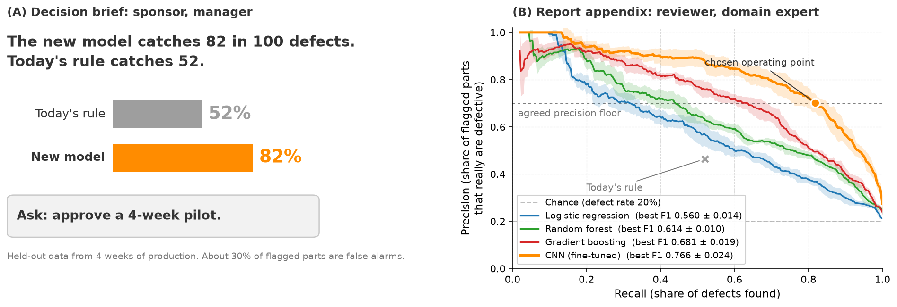

> **Navigation:** [<-- Pitching a Data-Science Idea](02-pitching-a-ds-idea.md) | [Part Index](00-index.md) | [Main Index](../index.md) | [From Script to Production System -->](04-script-to-production.md)

---

# Stakeholder Communication

**Requires**: [CRISP-DM Retrospective: From Coursework to Real Projects](01-crisp-dm-retrospective.md) · [Explainability](../part-06-reflection/05-explainability.md)

**Motivation**: We already touche it in the previous nugget [🖝 Pitching a Data-Science Idea](../part-09-projects-in-practice/02-pitching-a-ds-idea.md): If you did some technical work related to an AI project, none of it matters if the people who must act on your results do not understand your message. So how do you carry a technical finding to someone who does not speak your "language"?

> This nugget is about communicating results to non-technical audiences: why the translation is genuinely hard, how to calibrate to different audiences, and how to handle pushback by building trust and using your model's own explanations.

## Table of Contents

- [The Translation Problem: Technical Findings for Non-Technical Audiences](#the-translation-problem-technical-findings-for-non-technical-audiences)
- [Choosing the Right Output: Dashboards, Reports, Decision Briefs](#choosing-the-right-output-dashboards-reports-decision-briefs)
- [Handling Stakeholder Pushback (the Role of Trust)](#handling-stakeholder-pushback-the-role-of-trust)
- [Summary](#summary)

## The Translation Problem: Technical Findings for Non-Technical Audiences

In an experiment restated in [(Nussbaum, 2023)](../references.md#nussbaum2023communication), people chose a well-known song and tapped its rhythm on a table. On average, they estimated that half their listeners would be able to recognize the song. However, the success rate was very low - below ten percent. The reason is that those who tapped the melody could hear it in their heads, whereas the listeners heard random knocks. The phenomenon in the experiment has a name:

> **Curse of knowledge**: The curse of knowledge states that once you know something, it is hard to imagine what it is like not knowing it. It is the reason why we tend to systematically overestimate what our listeners understand.

For a data scientist, the "melody" is anything technical related to modeling decisions: When you speak of precision, recall, and feature importance, most other stakeholder hear "jargon". It's good to recognize this gap, then you can close it: This is your responsibility.

I think this is an important topic, which is why I wrote a checklist for communication of technical information (here's a [✪ direct link](https://www.researchgate.net/publication/370751075_Successful_Communication_of_Complex_Information), citation [(Nussbaum, 2023)](../references.md#nussbaum2023communication)).
One of the key reliable techniques is to **layer** explanations:

- start from the big picture which the audience should already share (e.g., the business goal)
- Always confirm shared understanding. _Always._
- Say less. You can always add detail, but cannot take it back once you have lost someone.
- Match the abstraction level to the listener. A sponsor needs the business metric, an engineer might be more interested in data-science metrics or confidence intervals.
- Reach for analogies or concrete examples when a concept is abstract. It lets the audience connect the unfamiliar to something they already know.

> **Analogy:** Explaining a model is like giving directions. You do not recite GPS coordinates. You start from a landmark the person already knows and add turns one at a time.

---

## Choosing the Right Output: Dashboards, Reports, Decision Briefs

The best output format follows from:

- your intention: are you trying to educate, to persuade, or to prompt a decision?
- who is receiving it - the target audience, again.

The following table is not exhaustive but outlines some directions.

| Output | Best when the audience needs to... | Typical audience |
|---|---|---|
| **Decision brief** | Make one specific call quickly | Sponsor, manager |
| **Report** | Understand method and results in depth | Domain experts, reviewers, auditors |
| **Dashboard** | Monitor a live quantity and explore it themselves | Operators, recurring users |

Don't hand a fifty-page notebook to someone who needs three sentences and a recommendation. Don't build an interactive dashboard when a one-time question needed a one-time answer.

> **Tip:** Whatever the format, visuals helpt a lot. A well-chosen chart summarizes a finding faster than a paragraph and is more memorable.

Keep visuals clean. Cluttered, over-labeled figures fail for similar reasons as jargon: They overwelm easily and as such risk the audience "tuning out".

In some way, the visualization skills from [🖝 Part III: Data Understanding](../part-03-data-understanding/00-index.md) transfer, now aimed at persuasion and storytelling rather than exploration.

---

## Handling Stakeholder Pushback (the Role of Trust)

Pushback usually means the stakeholder is engaged and something has not yet been made clear or credible. Establishing trust and, in the case of AI, model explainability.

Do the things that make you **trustworthy and credible** as a person and communicator:

- Be transparent about your methods, data sources, and your limitations. For the latter, a calibrated, upfront account of limitations does not only tend to build trust, it can also prevent surprises later.
- Recognize when to stop, or when a result are shaky (this is a professional skill as we discussed in [🖝 Academia vs. Business Data Science](../part-01-the-big-picture/05-academia-vs-business-ds.md)).

### The issue of trust with models

- Use explainability a communication tool: When a stakeholder asks "why should I believe this prediction?", a black box has no answer. An interpretable model does.
- _See [🖝 Explainability](../part-06-reflection/05-explainability.md)_, where we discussed basic feature importance/contributions as a particular family of explainability techniques. Note that features (input quantities) themselves need to make sense in the domain in order to be loadbearing for building trust in models.
- This is a further, concrete reason to prefer simpler models when the audience must trust and act on results. _see also [🖝 Start Simple](../part-06-reflection/02-start-simple.md)._
- Due to **algorithm aversion**, we tend to punish AI harder for visible errors compared to other humans

There's much more to be said about trust dynamics - it is fundamental in pitching, persuasion, and human relationships in general.

For example, when you confirm shared understanding (good habit as you go, not at the end), it is good to ask in a way that does not embarrass anyone: "Would it help to revisit the overall goal?" is better than "Does everyone follow?" because fear makes people nod along when they are lost. And dishonest communication, even when subtle, has an effect on trust. Either way.

> **Discussion:** Being fully transparent about your model's limitations can make stakeholders trust it more, or it can hand a skeptic the ammunition to reject the whole project. When is complete candor the right call, and when is it naive?

---

## Summary

- The curse of knowledge: We overestimate what our audiences understand. Closing that gap is our responsibility as communicators, not theirs.
- Layer explanations from the shared big picture down to detail, match the abstraction level to the listener, and say less.
- Choose the output format from your intention and audience: a decision brief to prompt a call, a report for depth, a dashboard for ongoing monitoring.
- Keep visuals clean.
- Trust is central for handling pushback - both in you yourself as a communicator (calibrating transparency about limitations) as well as in the models (explainability techniques - interpretable models often favorable.).

As always: Happy learning, happy life! 🫶

---

> **Navigation:** [<-- Pitching a Data-Science Idea](02-pitching-a-ds-idea.md) | [Part Index](00-index.md) | [Main Index](../index.md) | [From Script to Production System -->](04-script-to-production.md)

Script v1.8 (2026-08-19) · FGN
